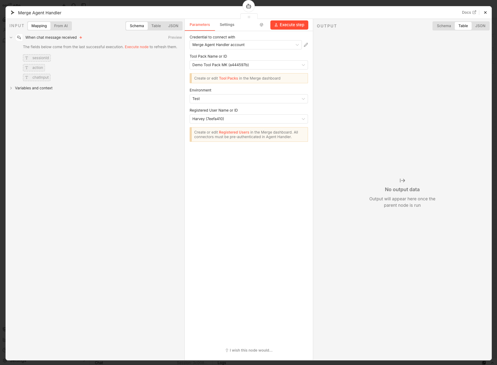

# n8n-nodes-merge

Community nodes for [n8n](https://n8n.io/) that integrate with [Merge](https://merge.dev/) products.

[n8n](https://n8n.io/) is a [fair-code licensed](https://docs.n8n.io/reference/license/) workflow automation platform.

[Installation](#installation) |
[Nodes](#nodes) |
[Credentials](#credentials) |
[Compatibility](#compatibility) |
[Resources](#resources)

## Installation

### Self-hosted n8n

Follow the [installation guide](https://docs.n8n.io/integrations/community-nodes/installation/) in the n8n community nodes documentation. Use the following package name:

```
n8n-nodes-merge
```

### n8n Cloud

1. Go to **Settings > Community Nodes**
2. Select **Install a community node**
3. Enter `n8n-nodes-merge`
4. Agree to the risks and click **Install**

## Nodes

### Merge Agent Handler Tool

Connects n8n AI agents to [Merge Agent Handler](https://merge.dev/agent-handler) Tool Packs via [MCP (Model Context Protocol)](https://modelcontextprotocol.io/).

Merge Agent Handler gives your AI agents access to pre-built integrations across HRIS, ATS, CRM, Accounting, Ticketing, File Storage, and more — all through a single API. Instead of building and maintaining individual integrations, you configure a Tool Pack once and your AI agent gets access to all the tools it needs.

#### Key Concepts

**Tool Packs** are bundles of connectors that define which third-party integrations your AI agent can access. Each Tool Pack contains one or more connectors (e.g., Greenhouse, Salesforce, Jira) and exposes their capabilities as tools that an AI agent can call. You create and manage Tool Packs in the [Merge Agent Handler dashboard](https://ah.merge.dev/tool-packs).


**Registered Users** represent the identities whose third-party accounts have been pre-authenticated with Merge. A Registered User can be an end user in your system or a system-level service account — any identity that has authenticated connectors. When your AI agent calls a tool, it acts on behalf of a specific Registered User — using their authenticated connections to read or write data in the connected services. You manage Registered Users and their authenticated connectors in the [Merge Agent Handler dashboard](https://ah.merge.dev/registered-users).


#### Prerequisites

1. A [Merge Agent Handler](https://ah.merge.dev/) account
2. An API key (Production or Test Access Key) from the Merge Agent Handler dashboard
3. At least one [Tool Pack](https://ah.merge.dev/tool-packs) created with connectors configured
4. At least one [Registered User](https://ah.merge.dev/registered-users) with connectors pre-authenticated

#### Setup

1. In n8n, add the **Merge Agent Handler Tool** node to your workflow and connect it to an **AI Agent** node's **Tool** input

    

2. Create a new credential with your Merge Agent Handler API key (see [Credentials](#credentials))
3. Select a **Tool Pack** from the dropdown
4. Choose an **Environment** (Production or Test)
5. Select a **Registered User** from the dropdown

    

The node exposes all tools from the selected Tool Pack to the connected AI agent. The agent can then call any of the available tools to interact with the integrations configured in the Tool Pack.

## Credentials

### Merge Agent Handler API

To authenticate with Merge Agent Handler:

1. Log in to the [Merge Agent Handler dashboard](https://ah.merge.dev/)
2. Navigate to **Settings > API Keys**
3. Copy your **Production** or **Test Access Key**
4. In n8n, create a new **Merge Agent Handler API** credential and paste the key

## Compatibility

- Requires n8n version 1.50.0 or later
- Tested with n8n v1.76.1

## Resources

- [Merge](https://merge.dev/)
- [Merge Agent Handler Documentation](https://docs.ah.merge.dev/Overview/Agent-Handler-intro)
- [Merge Agent Handler Dashboard](https://ah.merge.dev/)
- [n8n Community Nodes Documentation](https://docs.n8n.io/integrations/community-nodes/)

## License

[MIT](LICENSE)
