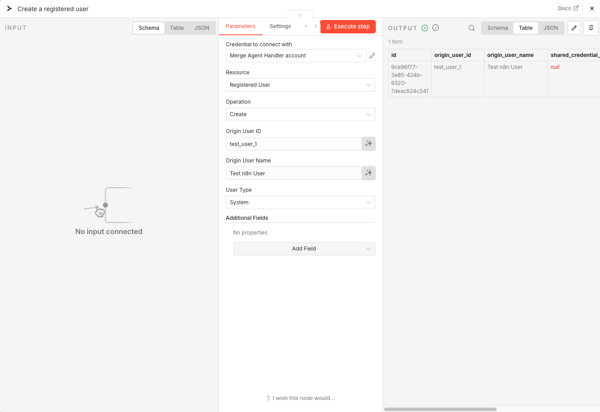
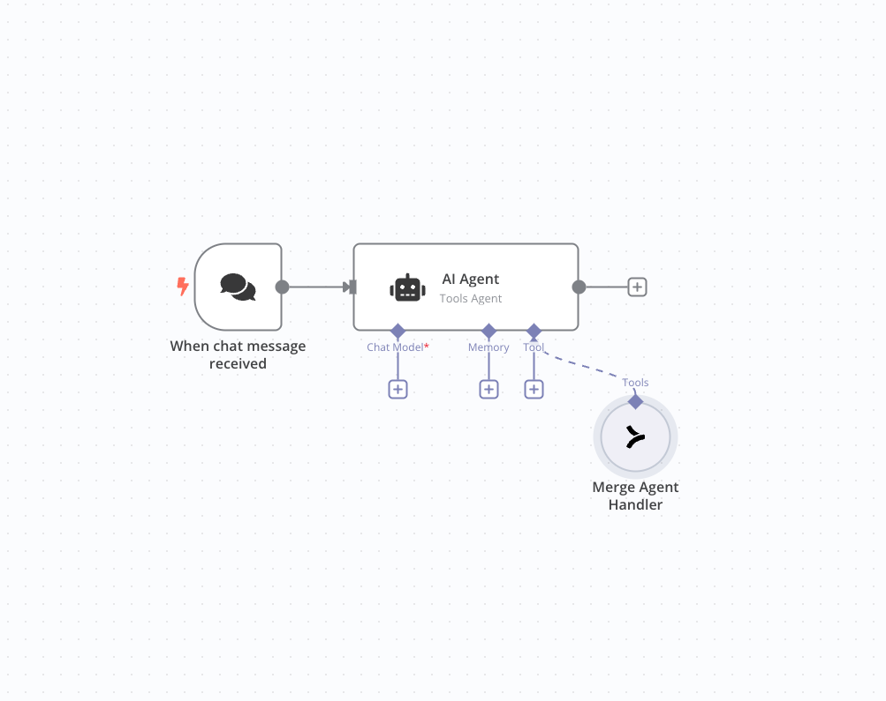
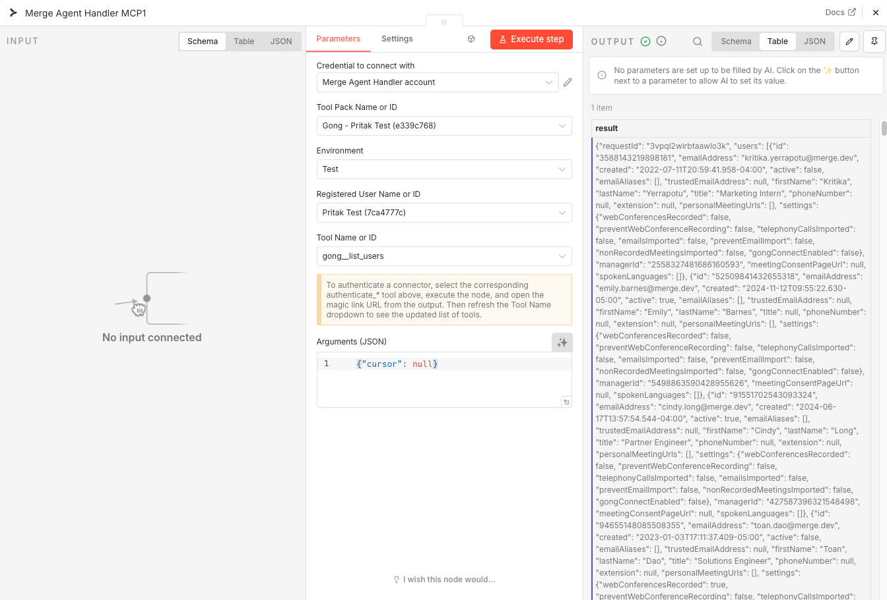
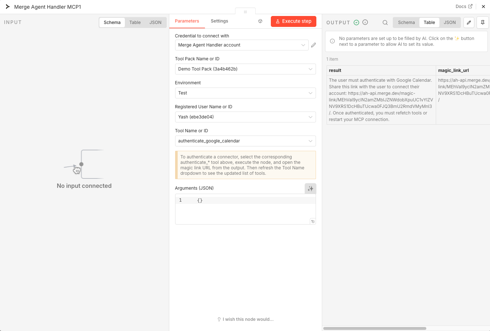
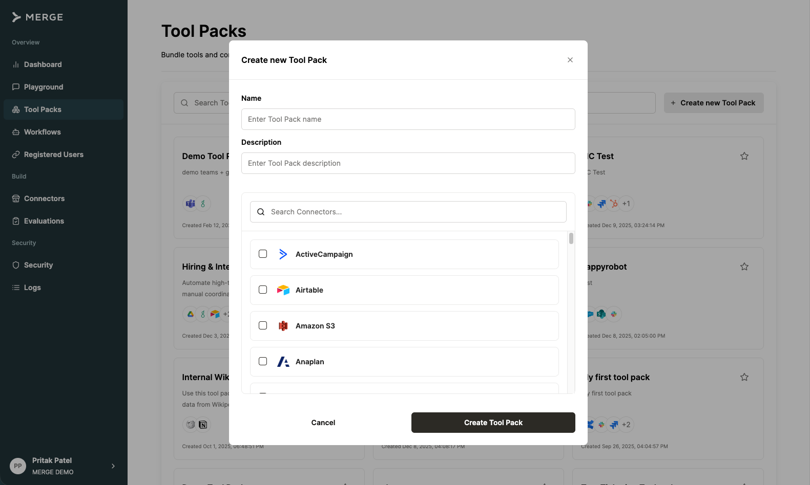
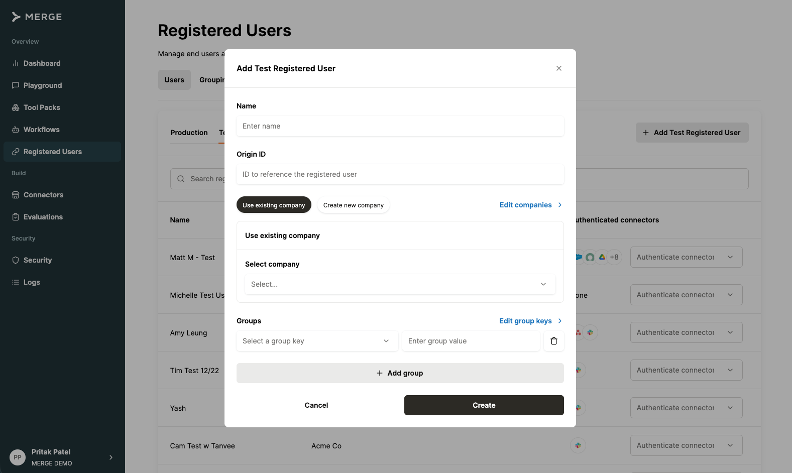

# n8n-nodes-merge

Community nodes for [n8n](https://n8n.io/) that integrate with [Merge Agent Handler](https://merge.dev/agent-handler).

This package provides two nodes:

- **Merge Agent Handler** — Manage Merge resources (registered users, tool packs, connectors, and more) directly from n8n workflows
- **Merge Agent Handler MCP** — Connect to Merge Tool Packs via MCP to call integration tools, either standalone or as an AI agent tool

[n8n](https://n8n.io/) is a [fair-code licensed](https://docs.n8n.io/reference/license/) workflow automation platform.

[Installation](#installation) |
[Nodes](#nodes) |
[Key Concepts](#key-concepts) |
[Credentials](#credentials) |
[Compatibility](#compatibility) |
[Resources](#resources)

## Installation

### Self-hosted n8n

Follow the [installation guide](https://docs.n8n.io/integrations/community-nodes/installation/) in the n8n community nodes documentation. Use the following package name:

```
n8n-nodes-merge
```

### n8n Cloud

1. Go to **Settings > Community Nodes**
2. Select **Install a community node**
3. Enter `n8n-nodes-merge`
4. Agree to the risks and click **Install**

## Nodes

### Merge Agent Handler

A standard n8n node for managing Merge Agent Handler resources through the REST API. Use this node to set up and configure your Merge environment directly from n8n workflows — create registered users, manage tool packs, generate link tokens, and more.

#### Resources & Operations

| Resource | Operations |
|----------|-----------|
| Registered User | Create, Get, List, Update, Delete |
| Tool Pack | Create, Get, List, Update, Delete |
| Connector | List, Get |
| Link Token | Create |
| Credential | Delete |
| Audit Log | List |
| Tool Search | Search |

#### Setup

1. Add the **Merge Agent Handler** node to your workflow
2. Create or select your **Merge Agent Handler API** credential (see [Credentials](#credentials))
3. Select a **Resource** (e.g., Registered User, Tool Pack)
4. Select an **Operation** (e.g., Create, List, Get)
5. Fill in the required fields for that operation

#### Example: Create a Registered User

1. Set **Resource** to `Registered User`
2. Set **Operation** to `Create`
3. Enter an **Origin User ID** (your system's user identifier)
4. Enter an **Origin User Name** (display name)
5. Select a **User Type** (Human or System)
6. Execute the node — the output contains the created user's ID and details



You can wire this node's output into subsequent nodes. For example, pipe the registered user ID into a Merge Agent Handler MCP node using an expression like `{{ $json.id }}`.

---

### Merge Agent Handler MCP

Connects to a Merge Agent Handler Tool Pack via [MCP (Model Context Protocol)](https://modelcontextprotocol.io/) and calls integration tools. This node supports two usage modes: **with an AI agent** and **standalone**.

#### Mode 1: With an AI Agent

Connect the MCP node to an AI Agent node's **Tool** input. The agent automatically discovers all available tools in the Tool Pack and calls them as needed during a conversation.

1. Add an **AI Agent** node to your workflow
2. Click **Add Tool** on the agent and select **Merge Agent Handler MCP**
3. Configure the credential, **Tool Pack**, **Environment**, and **Registered User**
4. The agent now has access to all tools in the selected Tool Pack



When a connector requires authentication, the agent will automatically call the corresponding `authenticate_*` tool and return a magic link URL. The user clicks the link to complete OAuth, and subsequent tool calls will work with the authenticated connection.

#### Mode 2: Standalone

Use the MCP node directly in a workflow to call a specific tool without an AI agent.

1. Add the **Merge Agent Handler MCP** node to your workflow
2. Configure the credential, **Tool Pack**, **Environment**, and **Registered User**
3. Select a **Tool Name** from the dropdown (tools are loaded from the Tool Pack)
4. Enter **Arguments (JSON)** if the tool requires input parameters
5. Execute the node — the output contains the tool's response



##### Authenticating connectors in standalone mode

If a connector hasn't been authenticated yet for the selected registered user:

1. Select the `authenticate_*` tool for that connector (e.g., `authenticate_linear`)
2. Execute the node
3. Copy the **magic link URL** from the output and open it in a browser
4. Complete the OAuth flow
5. Refresh the **Tool Name** dropdown to see the full list of available tools



## Key Concepts

**Tool Packs** are bundles of connectors that define which third-party integrations your AI agent can access. Each Tool Pack contains one or more connectors (e.g., Greenhouse, Salesforce, Jira) and exposes their capabilities as tools that can be called. You can create and manage Tool Packs using the **Merge Agent Handler** node in n8n or in the [Merge Agent Handler dashboard](https://ah.merge.dev/tool-packs).



**Registered Users** represent the identities whose third-party accounts have been authenticated with Merge. A Registered User can be an end user in your system or a system-level service account. When a tool is called, it acts on behalf of a specific Registered User — using their authenticated connections to read or write data in the connected services. You manage Registered Users in the [Merge Agent Handler dashboard](https://ah.merge.dev/registered-users).



## Prerequisites

1. A [Merge Agent Handler](https://ah.merge.dev/) account
2. An API key (Production or Test Access Key) from the Merge Agent Handler dashboard
3. At least one [Tool Pack](https://ah.merge.dev/tool-packs) created with connectors configured (can be created via the Merge Agent Handler node or the dashboard)
4. At least one [Registered User](https://ah.merge.dev/registered-users) (can be created via the Merge Agent Handler node or the dashboard)

## Credentials

### Merge Agent Handler API

To authenticate with Merge Agent Handler:

1. Log in to the [Merge Agent Handler dashboard](https://ah.merge.dev/)
2. Navigate to **Settings > API Keys**
3. Copy your **Production** or **Test Access Key**
4. In n8n, create a new **Merge Agent Handler API** credential and paste the key

Both nodes share the same credential.

## Compatibility

- Requires n8n version 1.50.0 or later
- Tested with n8n v2.9.4

## Resources

- [Merge](https://merge.dev/)
- [Merge Agent Handler Documentation](https://docs.ah.merge.dev/Overview/Agent-Handler-intro)
- [Merge Agent Handler API Reference](https://docs.ah.merge.dev/api-reference/overview)
- [Merge Agent Handler Dashboard](https://ah.merge.dev/)
- [n8n Community Nodes Documentation](https://docs.n8n.io/integrations/community-nodes/)

## License

[MIT](LICENSE)
